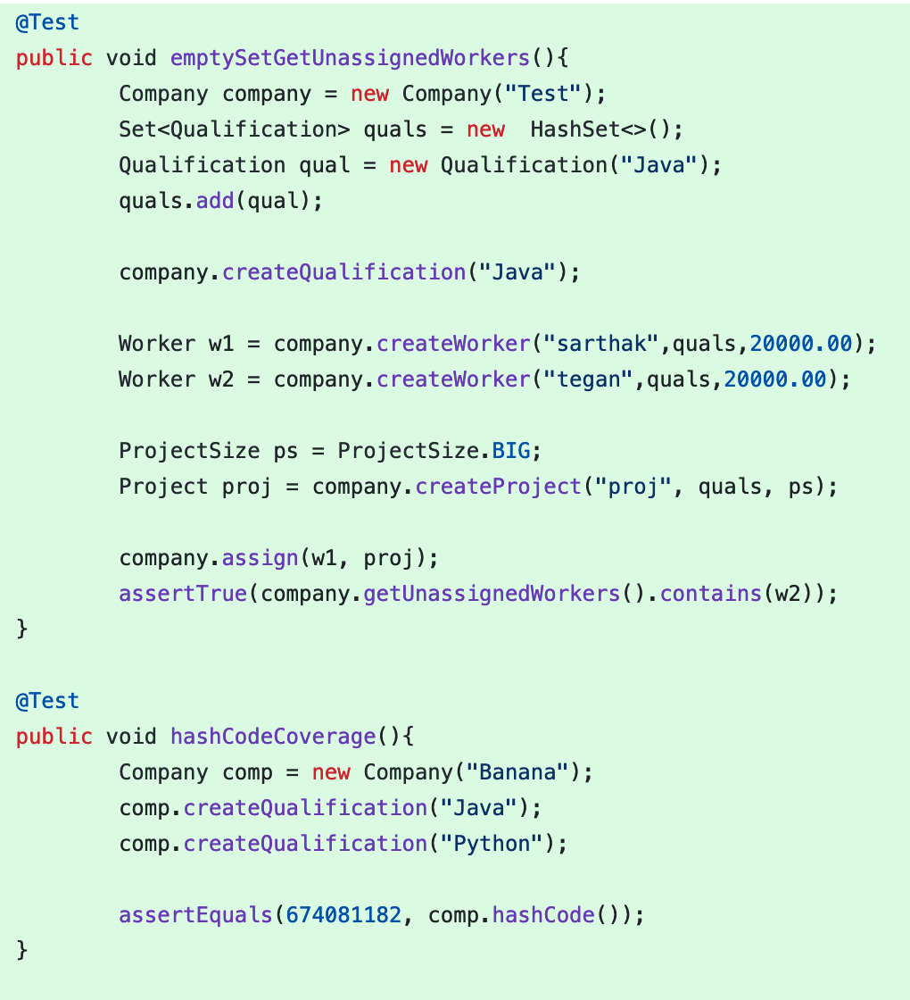
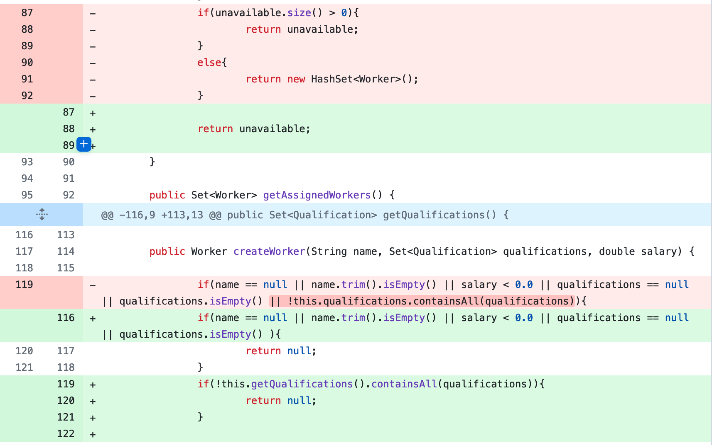
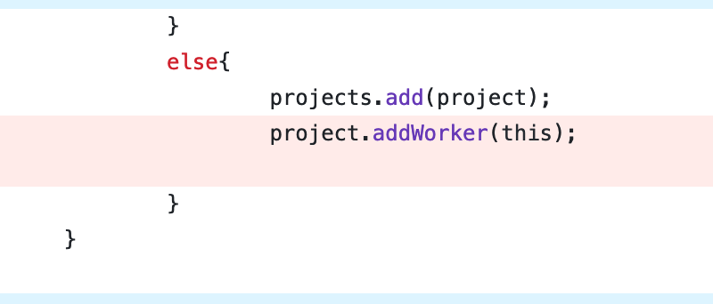
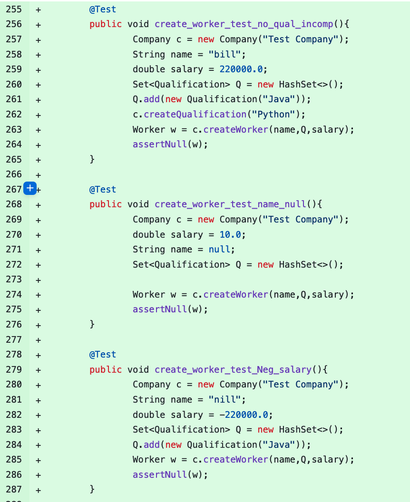
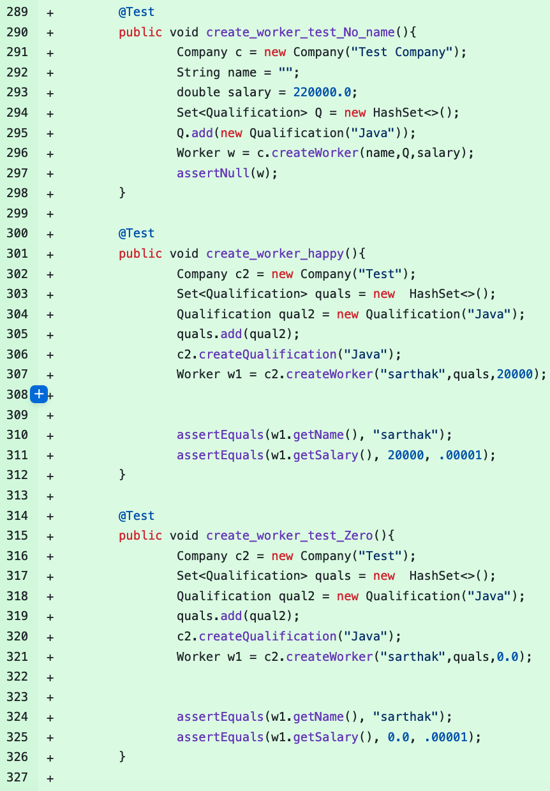
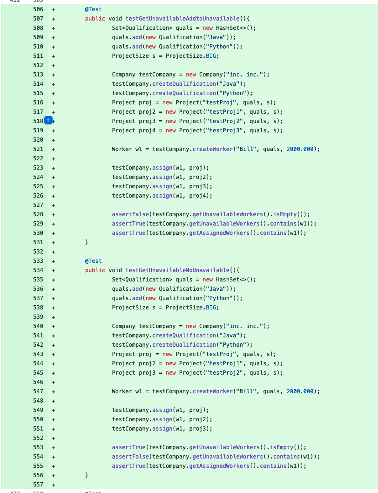

# Original Mutation Scores
| Name | Line Coverage | Mutation Coverage | Test Strength |
|------|---------------|-------------------|---------------|
| Company.java | 124/130 (95%) | 68/81 (84%) | 68/78 (87%) |
| Project.java | 103/103 (100%) | 43/45 (96%) | 43/45 (93%) |
| Qualification.java | 34/34 (100%) | 15/16 (94%) | 15/16 (94%) |
| Worker.java | 61/61 (100%) | 34/35 (97%) | 34/35 (97%) |
| Overall | 328/334 (98%) | 161/178 (90%) | 161/175 (92%) |

 - Overall our mutation scores are pretty good. With an overall mutation coverage of 90% we killed the vast majority of mutant without particularly focusing on them. This is probabaly due to the fact that we focused on getting a lot of line coverage for each of the classes. The class that needs to most work in terms of mutations is Company.java with a mutation score of 84%. This is also the class we have the least coverage in. However, 84% is still a fairly good mutation score even though it is our worst. The score can definetly be improved, but as a start it is very good!

# After Mutation Scores
| Name | Line Coverage | Mutation Coverage | Test Strength |
|------|---------------|-------------------|---------------|
| Company.java | 123/123 (100%) | 72/77 (94%) | 72/76 (95%) |
| Project.java | 95/95 (100%) | 43/45 (96%) | 43/45 (93%) |
| Qualification.java | 33/33 (100%) | 15/16 (94%) | 15/16 (94%) |
| Worker.java | 61/61 (100%) | 32/33 (97%) | 32/33 (97%) |
| Overall | 318/319 (98%) | 163/172 (90%) | 163/171 (92%) |

 - After some refactoring the mutation score went from 89% to 95% overall. The main class that was focused on was Company.java. It is also the only ckass that we initally did not have 100% line coverage in. After refactoring test to up the mutation score the line coverage also went up to 100%.

### Changes in tests

- A lot of the missed mutations were due to empty sets not being checked, an Arithmetic Operator Replacement mutation, or mistakes in the code. In the tests checking for replacing things with empty sets tests were added and the mutations were killed. The Arithmetic Operator Replacement mutations were mainly due to the hashCode() functions. In order to remedy this a certain hashCode() was calculated directly and compared with an assertEquals in order to kill the mutations that replaced the operators. This made it so when the operators were replaced the hashCode value was different and therefore the test killed the mutant. The other issues had to do with unreachable code or inncorrect code. For example one of the methods added a worker to a project set when the another function was supposed to do that. While checking for mutants it was found that because if this some of the code never got reached so when it mutated no test could kill it. In situations like this the only option was to refactor the code in order to kill the mutant because the code was unreachable. This happened on several mutants and that is why there are less mutants in the after scores than in the origional scores.

