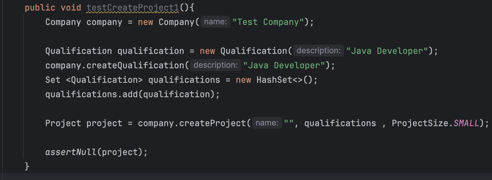
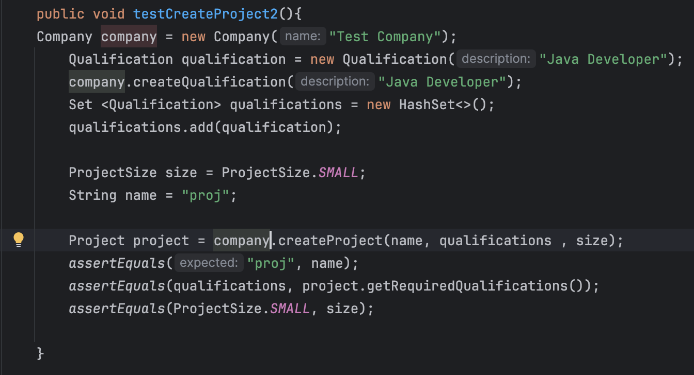
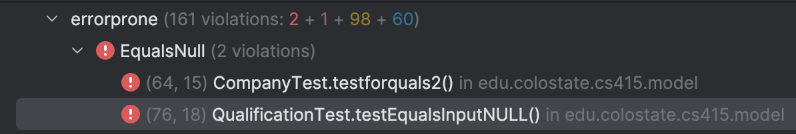

## SpotBugs
### Dead Stores
#### Qualficiation Q

  In this bug there was storage of a dead variable. This means that variable is not used or read in any subsequent code. This bug is realatively easy to fix as all one has to do is delete the code. The first two images show the SpotBugs report before deletion and the code before refactoring. The second two images show the refactored code and the change in the SpotBugs report. It can be seen that the Qualification Q that is not used is deleted and the Spotbugs report for Dead Stores goes from 32 to 31.

#### Qualification Q1

  In this bug there was storage of a dead variable. This means that variable is not used or read in any subsequent code. This bug is very similar to the one above in that all you have to do is delete the dead store. The first two images show the SpotBugs report before deletion and the code before refactoring. The second two images show the refactored code and the change in the SpotBugs report. It can be seen that the Qualification q1 that is not used is deleted and the Spotbugs report for Dead Stores goes from 31 to 30.

#### Project proj5

This bug is similar to the two above in the way that it is the storage of a variable that is not used in subsequent code. In this section of the code there were 3 tests that all stored the object Project proj5 when it is not used. I chose to delete all of these instances so in the first two images the items in the Dead Store was 30 and proj5 is shown to be declared. In the last two images show Dead store as 27 and show the code refactored without Project proj5.

### Useless Object Created

#### Set<Worker> workers

This bug means an object is created and stored, but never utilized or referenced to making it ultimately useless. For this bug in particular the useless object that was created was the workers hashset. It is never utlized in this particular test because it was testing a function that had to do with worker in relation to a project not workers in relation to a project. Therefore the hashset was created but never used and was taking up space uselessly. The first two images show the hashset workers and also show the Useless Objects Created at 10 items. The second two images show the useless object deleted as well as the Useless Objects Created at 9 items

## PMD

### Local Variable nameing Conventions 

This mistakes was a common one in our code and was a coding style problem. If a variable was capitalized or named amgibuously it was flagged for this mistake. To fix this mistake one simply has to change the name of the variable. All of these mistakes were addressed and they are displayed through the screenshot below. Since all of these mistakes were very similar to fix they will not be individually explained.

#### Company Equals

#### Test For Equals 1 and 2 

#### Equals 

#### Test For Create Project 

#### Test For Create Project 2

#### Test For Create Project 3

#### Test For Create Project 4

#### Test No Qualifications

#### PMD After

### Equals Null

This mistake is if there is an equal to null in the code.

#### PMD Before

#### Test For Equals Two

For this error in the assertFalse there was the statement company.equals(null) and this was fixed by replacing the statement with assertNotNull(company)

#### Test Equals Input Null

#### PMD After

